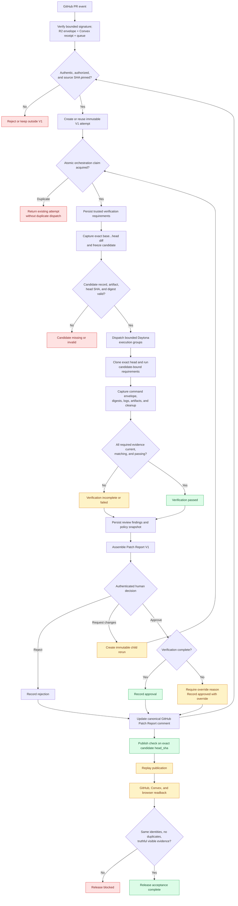

# PatchPlane critical path

This document defines the shortest product and release path from an untrusted
AI patch request to a human-reviewed, evidence-backed Patch Report published to
GitHub.

It is a navigation document, not a second source of truth:

- [`SPEC.md`](../SPEC.md) defines product, security, and trust semantics.
- [`docs/adr/0001-attempt-candidate-evidence-identity.md`](./adr/0001-attempt-candidate-evidence-identity.md) defines attempt, candidate, evidence, rerun, and publication identity.
- [`docs/acceptance-tests.md`](./acceptance-tests.md) is authoritative for whether each release claim is `Automated`, `Live`, `Historical`, or `Missing`.
- [`docs/m10-acceptance-runbook.md`](./m10-acceptance-runbook.md) defines the credentialed release procedure.
- [`ROADMAP.md`](../ROADMAP.md) tracks implementation order and scope.

Do not mark a stage complete here. Change the implementation and its acceptance
evidence, then update the acceptance matrix.

## Product outcome

PatchPlane must answer whether one specific AI-generated patch attempt has
earned human trust:

```text
authenticated PR intake
→ immutable attempt and trusted requirements
→ exact incoming candidate freeze
→ isolated Daytona verification
→ optional read-only agent review
→ review and policy
→ human decision
→ canonical Patch Report publication
```

Agent exit `0`, candidate capture, verification, external review, policy,
human approval, and publication are separate facts. A later fact must not
silently upgrade an earlier one.

## Critical-path stages

| Stage | Product question                         | Owning implementation boundaries                                                                                  | Required invariant and fail-closed outcome                                                                                                                                                                                                                                                                                                                                               |
| ----: | ---------------------------------------- | ----------------------------------------------------------------------------------------------------------------- | ---------------------------------------------------------------------------------------------------------------------------------------------------------------------------------------------------------------------------------------------------------------------------------------------------------------------------------------------------------------------------------------- |
|     1 | Is the request authentic and authorized? | Edge webhook Worker, R2/Convex delivery outbox, `apps/source-control`, GitHub plugin, WorkOS/Convex authorization | For GitHub webhooks, verify the bounded signature before raw-envelope R2 storage, then persist its digest-bound Convex receipt before enqueue. Replay only generation-fenced, lease-expired ambiguous sends; acknowledge only durable terminal outcomes. For non-webhook control requests, require authenticated and authorized WorkOS identity. Reject unauthorized or malformed input. |
|     2 | What exact PR candidate arrived?         | GitHub normalization, `StartWorkflowFromIntake`, Convex `createFromExternalIntake`                                | A V1 PR attempt requires webhook-authenticated base and head SHAs plus repository/PR identity. Missing identity cannot enter V1 execution.                                                                                                                                                                                                                                               |
|     3 | Is this one immutable attempt?           | Convex workflow/rerun mutations, orchestration and execution-group claims                                         | One V1 run is one attempt. Duplicate delivery reuses it. One orchestration claim dispatches the bounded plan; stable per-group claims prevent duplicate Linux, Windows, or Computer Use sandboxes.                                                                                                                                                                                       |
|     4 | What evidence is required?               | `PersistConfiguredVerificationRequirements`, trusted deployment/repository configuration                          | Persist a bounded trusted plan before candidate freeze or provider execution. A candidate or provider result cannot create or weaken a requirement. No result means incomplete, not unconfigured.                                                                                                                                                                                        |
|     5 | What exact candidate is being judged?    | GitHub intake, R2 candidate artifact, Convex candidate persistence                                                | Before Daytona or Pi starts, freeze exact `baseSha...headSha` diff bytes and digest. Persist the candidate artifact and require exact `headSha` checkout. A generated diff is a different candidate.                                                                                                                                                                                     |
|     6 | Where does untrusted code run?           | `RunIncomingVerificationPlan`, execution-group storage, read-only review, Daytona plugin                          | Clone the exact candidate head into bounded ephemeral execution groups without long-lived control-plane credentials. Shared sessions are disclosed; resize/fan-out/background leakage is forbidden. Capacity, setup, execution, mutation, and cleanup outcomes remain distinct.                                                                                                          |
|     7 | What independently passed or failed?     | `RunIncomingVerificationPlan`, `PersistSandboxVerificationEvidence`, `evaluateVerificationCoverage`               | Correlate requirement, candidate, command, platform, architecture, artifacts, and digest before/after. Missing, blocked, errored, mutated, stale, truncated, or mismatched evidence is incomplete or failed.                                                                                                                                                                             |
|     8 | What did review and policy conclude?     | `ProposeMergeDecision`, `ReviewService`, `PolicyService`                                                          | Persist review findings and a policy digest over one coherent candidate/evidence snapshot. Review confidence is not test verification.                                                                                                                                                                                                                                                   |
|     9 | Can a human understand the evidence?     | `AssemblePatchReportV1`, Convex detail projection, workflow investigation UI                                      | Assemble only matching attempt/candidate records. Legacy or truncated evidence must not be silently represented as complete V1 evidence.                                                                                                                                                                                                                                                 |
|    10 | What did the authorized human decide?    | WorkOS-authenticated decision server function and Convex mutation                                                 | Bind the decision to the displayed execution, candidate, review, and policy IDs. Incomplete approval requires a durable override reason.                                                                                                                                                                                                                                                 |
|    11 | Is another attempt needed?               | `createRerun`, rerun Worker route, rerun UI                                                                       | Create one reasoned, idempotent child attempt pinned to the same source. Never reopen or rewrite the parent.                                                                                                                                                                                                                                                                             |
|    12 | What is published externally?            | `PublishDecisionToSource`, GitHub plugin, publication claims                                                      | Update one root-scoped canonical comment. Publish a check only against the frozen candidate `headSha`; never fall back to a base SHA, newer head, or unrelated generated candidate. Lease and fence dispatch to prevent stale or duplicate effects.                                                                                                                                      |
|    13 | Can the release claim be reproduced?     | Trust-loop smoke, browser acceptance, GitHub/Convex readback                                                      | From one release-candidate SHA, prove the decision, publication replay, stable external IDs, browser projection, and sandbox cleanup. Any `Missing` acceptance row keeps the release incomplete.                                                                                                                                                                                         |

## Runtime and decision flow



## Hosted webhook delivery boundary

The edge verifies the bounded raw GitHub body before writing its signed queue
envelope to R2 and a digest-bound receipt to Convex. Queue delivery is therefore
recoverable through a generation-fenced, lease-expired scheduled outbox after
an ambiguous send. An atomic processing claim suppresses duplicate deliveries. Each authenticated
receipt must bind to the exact newly created or reused candidate workflow before
consumers use one-message batches and acknowledge only after a terminal receipt is durable;
DLQ handling uses delayed retries and atomically creates missing execution
groups plus terminal error results before failing a workflow. The entire
source-control service-binding request is abort-bounded, independently of the
trusted execution deadline. Queue logs remain operational telemetry, not Patch
Report evidence.

## Durable truth and trust boundaries

- **Convex** owns normalized workflow, provenance, evidence metadata, review,
  policy, decision, and publication truth.
- **R2** owns raw evidence artifact bytes. Convex stores their hashes and
  references.
- **GitHub** is an external publication surface, not PatchPlane's provenance
  store.
- **Sentry and analytics** are operational/product telemetry, never evidence or
  provenance. Sentry capture and breadcrumb research is documented in
  [`docs/sentry-error-capture-research.md`](./sentry-error-capture-research.md).
- **Daytona and Pi output** remain untrusted until decoded and correlated to
  PatchPlane-owned types. Requested Daytona isolation policy is not enforcement
  evidence. Trusted Linux groups now record the PatchPlane-declared class
  source plus effective provider image/target, OS/architecture, resources,
  lifecycle/network readback, public/link/volume posture, bounded Daytona
  asynchronous session/command identity persisted before terminal/log polling,
  and structured delete-to-not-found cleanup. Hosted PR 150 persisted a passed
  candidate/plan/group-bound Linux result with effective environment, process,
  artifact, and delete-to-not-found evidence before its queue receipt became
  terminal/completed and the workflow reached review/policy. Provider-observed class, effective
  resource-limit
  enforcement, snapshot/fork/prior-state isolation, tier exceptions, broader
  ingress enforcement, crash cleanup reconciliation, and representative egress
  still require live evidence. Stop,
  pause, archive, ephemeral,
  or auto-delete configuration alone is not deletion proof. Concurrent sessions
  share sandbox state; rate/capacity errors and incomplete background cleanup
  are provider/execution gaps rather than repository test failures.
- **The browser** supplies user intent, not authoritative workflow identity or
  trust facts.

## Release-completion path

Run these steps against one release-candidate commit and one
maintainer-controlled test PR:

1. Run `bun install --frozen-lockfile`, `bun run verify`, and
   `bun run format:check`.
2. Deploy matching Convex functions, Workers, client assets, and configuration.
3. Run the trust-loop preflight and create a fresh V1 workflow.
4. Confirm the pinned source, frozen candidate, bounded execution groups,
   effective isolation evidence, raw artifact hashes, declared requirements,
   results, review, policy, and provenance.
5. Stop at the required human boundary and inspect the Patch Report in an
   authenticated browser.
6. Record approve, reject, or request-changes with a rationale. If verification
   is incomplete, approval must include an explicit override reason.
7. Exercise one immutable child rerun and confirm the parent is unchanged.
8. Replay publication from the same durable decision and confirm stable GitHub
   and Convex IDs with no duplicate external objects.
9. Read the final projection back through the authenticated browser and confirm
   that visible claims match durable records.
10. Record cleanup and update `docs/acceptance-tests.md` only with evidence from
    that exact release candidate.

The detailed commands, expected JSONL states, and cleanup procedure are in the
[M10 acceptance runbook](./m10-acceptance-runbook.md).

## Alpha closure decisions

### Candidate-bound GitHub checks

GitHub check runs are commit-bound. The alpha incoming PR candidate has an exact
`headSha`, so PatchPlane publishes only against that SHA after candidate-bound
evidence, review, policy, and human decision exist. A sandbox-generated diff or
unrelated smoke candidate cannot be attached to the incoming PR head. Live
acceptance also requires the operational GitHub App installation to grant
`checks: write` and replay to update the same external check identity.

### Native-platform verification

The alpha verification envelope uses Daytona only:

- Linux requirements run in ephemeral Daytona Linux sandboxes.
- Windows requirements target the bounded Daytona `windows-small` snapshot, but
  remain blocked until the PowerShell-compatible evidence adapter and live
  smoke are complete.
- Browser/GUI requirements run through Daytona Computer Use in an explicitly
  configured Linux or Windows sandbox and require candidate-bound screenshots,
  recordings, or other declared artifacts. Provider availability alone is not
  implementation or verification evidence.
- Daytona documents macOS Computer Use as private alpha; PatchPlane does not use
  it. macOS and production-credential-dependent requirements have no supported
  alpha executor and remain blocked.

An unavailable environment does not prevent a truthful incomplete Patch Report
or an explicit human override, but it prevents a fully passed verification
claim. Normal GitHub CI results do not substitute for this independent
PatchPlane execution plane.

## Non-critical work before alpha closure

Do not move these ahead of the critical path unless they remove a demonstrated
release blocker:

- additional Git forges or sandbox providers unrelated to a required platform;
- generalized CI orchestration or requirement inference;
- advanced policy language or a broad policy editor;
- signed attestations;
- SQL storage plugins;
- analytics expansion;
- complex provenance graph UI;
- autonomous merge.
