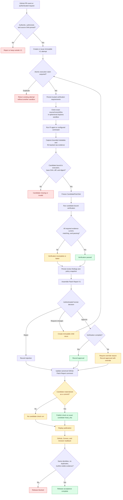

# PatchPlane critical path

This document defines the shortest product and release path from an untrusted
AI patch request to a human-reviewed, evidence-backed Patch Report published to
GitHub.

It is a navigation document, not a second source of truth:

- [`SPEC.md`](../SPEC.md) defines product, security, and trust semantics.
- [`docs/adr/0001-attempt-candidate-evidence-identity.md`](./adr/0001-attempt-candidate-evidence-identity.md) defines attempt, candidate, evidence, rerun, and publication identity.
- [`docs/acceptance-tests.md`](./acceptance-tests.md) is authoritative for whether each release claim is `Automated`, `Live`, `Historical`, or `Missing`.
- [`docs/m10-acceptance-runbook.md`](./m10-acceptance-runbook.md) defines the credentialed release procedure.
- [`ROADMAP.md`](../ROADMAP.md) tracks implementation order and scope.

Do not mark a stage complete here. Change the implementation and its acceptance
evidence, then update the acceptance matrix.

## Product outcome

PatchPlane must answer whether one specific AI-generated patch attempt has
earned human trust:

```text
request
→ immutable attempt
→ isolated agent execution
→ frozen candidate
→ independent verification
→ review and policy
→ human decision
→ canonical Patch Report publication
```

Agent exit `0`, candidate capture, verification, external review, policy,
human approval, and publication are separate facts. A later fact must not
silently upgrade an earlier one.

## Critical-path stages

| Stage | Product question                         | Owning implementation boundaries                                                         | Required invariant and fail-closed outcome                                                                                                                                                                         |
| ----: | ---------------------------------------- | ---------------------------------------------------------------------------------------- | ------------------------------------------------------------------------------------------------------------------------------------------------------------------------------------------------------------------ |
|     1 | Is the request authentic and authorized? | `apps/source-control`, GitHub plugin, WorkOS/Convex authorization                        | Verify webhook signatures or authenticated WorkOS identity before persistence. Reject unauthorized or malformed input.                                                                                             |
|     2 | What exact source is being changed?      | GitHub normalization, `StartWorkflowFromIntake`, Convex `createFromExternalIntake`       | A V1 attempt requires an authoritative immutable source revision. Unpinned intake cannot enter V1 execution.                                                                                                       |
|     3 | Is this one immutable attempt?           | Convex workflow/rerun mutations, `StorageService.claimWorkflowExecution`                 | One V1 run is one attempt. Duplicate delivery reuses the existing run. One atomic claim and persistence guard permit at most one sandbox execution.                                                                |
|     4 | What evidence is required?               | `PersistConfiguredVerificationRequirements`, trusted deployment/repository configuration | Persist requirements before repository preparation or provider execution. A provider result cannot create or weaken a requirement. No result means incomplete, not unconfigured.                                   |
|     5 | Where does untrusted code run?           | `RunSandboxAgentForWorkflow`, `RunSandboxCommandForWorkflow`, Daytona plugin             | Clone the pinned revision into an ephemeral sandbox without long-lived control-plane credentials. Setup, execution, and cleanup failures remain explicit.                                                          |
|     6 | What exact candidate was produced?       | Daytona evidence capture, R2 artifacts, Convex candidate persistence                     | Freeze the candidate before verification. Bind it to the producing execution, pinned `baseSha`, exact diff artifact, and SHA-256 candidate digest. Missing or mismatched identity is invalid.                      |
|     7 | What independently passed or failed?     | `PersistSandboxVerificationEvidence`, `evaluateVerificationCoverage`                     | Correlate requirement, candidate, command, platform, architecture, artifacts, and digest before/after. Missing, blocked, errored, mutated, stale, truncated, or mismatched evidence is incomplete or failed.       |
|     8 | What did review and policy conclude?     | `ProposeMergeDecision`, `ReviewService`, `PolicyService`                                 | Persist review findings and a policy digest over one coherent candidate/evidence snapshot. Review confidence is not test verification.                                                                             |
|     9 | Can a human understand the evidence?     | `AssemblePatchReportV1`, Convex detail projection, workflow investigation UI             | Assemble only matching attempt/candidate records. Legacy or truncated evidence must not be silently represented as complete V1 evidence.                                                                           |
|    10 | What did the authorized human decide?    | WorkOS-authenticated decision server function and Convex mutation                        | Bind the decision to the displayed execution, candidate, review, and policy IDs. Incomplete approval requires a durable override reason.                                                                           |
|    11 | Is another attempt needed?               | `createRerun`, rerun Worker route, rerun UI                                              | Create one reasoned, idempotent child attempt pinned to the same source. Never reopen or rewrite the parent.                                                                                                       |
|    12 | What is published externally?            | `PublishDecisionToSource`, GitHub plugin, publication claims                             | Update one root-scoped canonical comment. Publish a check only against a materialized candidate `headSha`; never fall back to the original PR SHA. Lease and fence dispatch to prevent stale or duplicate effects. |
|    13 | Can the release claim be reproduced?     | Trust-loop smoke, browser acceptance, GitHub/Convex readback                             | From one release-candidate SHA, prove the decision, publication replay, stable external IDs, browser projection, and sandbox cleanup. Any `Missing` acceptance row keeps the release incomplete.                   |

## Runtime and decision flow



## Durable truth and trust boundaries

- **Convex** owns normalized workflow, provenance, evidence metadata, review,
  policy, decision, and publication truth.
- **R2** owns raw evidence artifact bytes. Convex stores their hashes and
  references.
- **GitHub** is an external publication surface, not PatchPlane's provenance
  store.
- **Sentry and analytics** are operational/product telemetry, never evidence or
  provenance. Sentry capture and breadcrumb research is documented in
  [`docs/sentry-error-capture-research.md`](./sentry-error-capture-research.md).
- **Daytona and Pi output** remain untrusted until decoded and correlated to
  PatchPlane-owned types.
- **The browser** supplies user intent, not authoritative workflow identity or
  trust facts.

## Release-completion path

Run these steps against one release-candidate commit and one
maintainer-controlled test PR:

1. Run `bun install --frozen-lockfile`, `bun run verify`, and
   `bun run format:check`.
2. Deploy matching Convex functions, Workers, client assets, and configuration.
3. Run the trust-loop preflight and create a fresh V1 workflow.
4. Confirm the pinned source, single execution, frozen candidate, raw artifact
   hashes, declared requirements, results, review, policy, and provenance.
5. Stop at the required human boundary and inspect the Patch Report in an
   authenticated browser.
6. Record approve, reject, or request-changes with a rationale. If verification
   is incomplete, approval must include an explicit override reason.
7. Exercise one immutable child rerun and confirm the parent is unchanged.
8. Replay publication from the same durable decision and confirm stable GitHub
   and Convex IDs with no duplicate external objects.
9. Read the final projection back through the authenticated browser and confirm
   that visible claims match durable records.
10. Record cleanup and update `docs/acceptance-tests.md` only with evidence from
    that exact release candidate.

The detailed commands, expected JSONL states, and cleanup procedure are in the
[M10 acceptance runbook](./m10-acceptance-runbook.md).

## Alpha closure decisions

### Candidate-bound GitHub checks

GitHub check runs are commit-bound. A sandbox-only diff has no candidate
`headSha`, so PatchPlane must not attach its evidence to the original PR SHA.
Before claiming live candidate-check publication, choose and implement one of:

1. safely materialize the candidate as a durable commit/branch and publish the
   check against that exact SHA; or
2. explicitly scope alpha to canonical comment publication and keep candidate
   checks out of the release claim.

Draft PR publication depends on the same materialization decision.

### Native-platform verification

A Linux Daytona sandbox cannot prove macOS- or Windows-specific behavior.
Native evidence remains blocked until a safe matching provider is configured.
This does not prevent a truthful incomplete Patch Report or an explicit human
override, but it does prevent a fully passed verification claim for a repository
that requires that platform.

## Non-critical work before alpha closure

Do not move these ahead of the critical path unless they remove a demonstrated
release blocker:

- additional Git forges or sandbox providers unrelated to a required platform;
- generalized CI orchestration or requirement inference;
- advanced policy language or a broad policy editor;
- signed attestations;
- SQL storage plugins;
- analytics expansion;
- complex provenance graph UI;
- autonomous merge.
